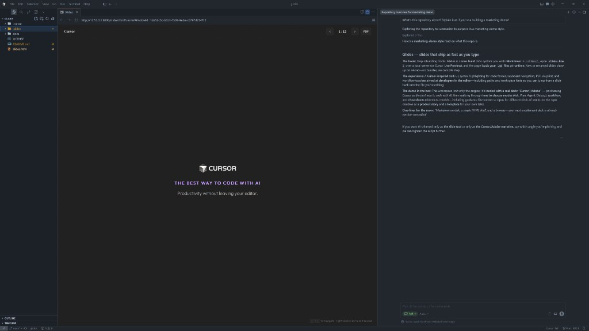

# Glides

**Glides** is a zero-build slide deck, available right in Cursor!

---

## Features

- **Keyboard and click navigation** — Move through the deck with arrow keys or Space, or click the left or right side of the slide stage.
- **Jump to the source file** — Right-click the stage to copy the current slide’s path into the clipboard. When the deck is served from `http://localhost`, you can set the repo root with `workspace` in `00-configuration.md`, a `?workspace=…` query on the URL, or the one-time prompt so the copied path is absolute and easy to open in the editor.
- **PDF export** — The top bar **PDF** control opens the system print dialog (Save as PDF). Editor preview iframes often block printing; in that case the page can copy the deck URL so you can open it in Chrome or Edge and export from there.
- **Print-friendly output** — Exported PDFs use a light handout style; the live deck keeps the dark theme.
- **Resume where you left off** — The last viewed slide is remembered in `localStorage` for each deck path.

## Quick start

1. Serve the repository root over HTTP (for example `python3 -m http.server`, or open `slides.html` with Cursor’s **Live Preview** extension).
2. Open `slides.html` in that context—not `file://`, because the deck loads `.md` files with `fetch`.
3. Edit slides under `.slides/`; when you leave and return to the tab, the deck reloads (debounced) so changes show up without a manual refresh.
